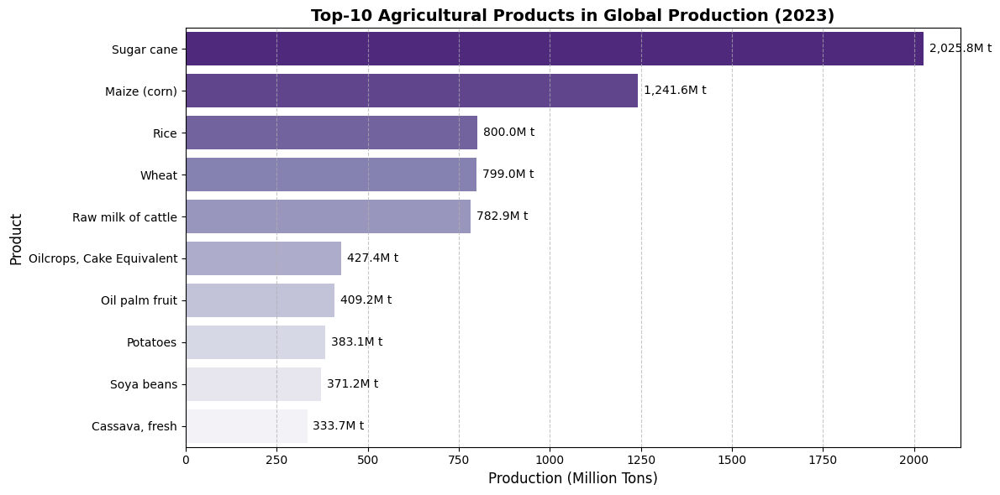
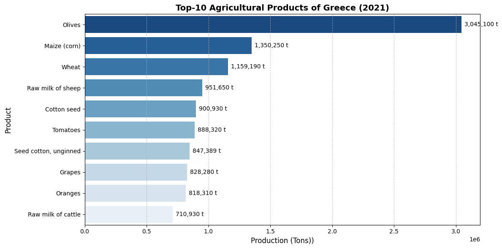
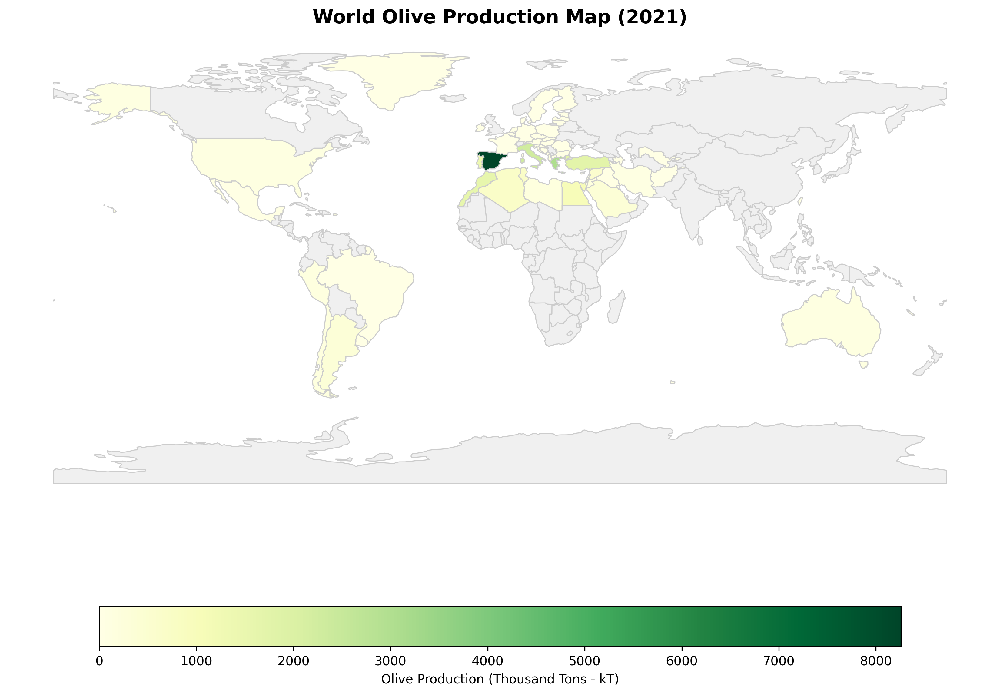
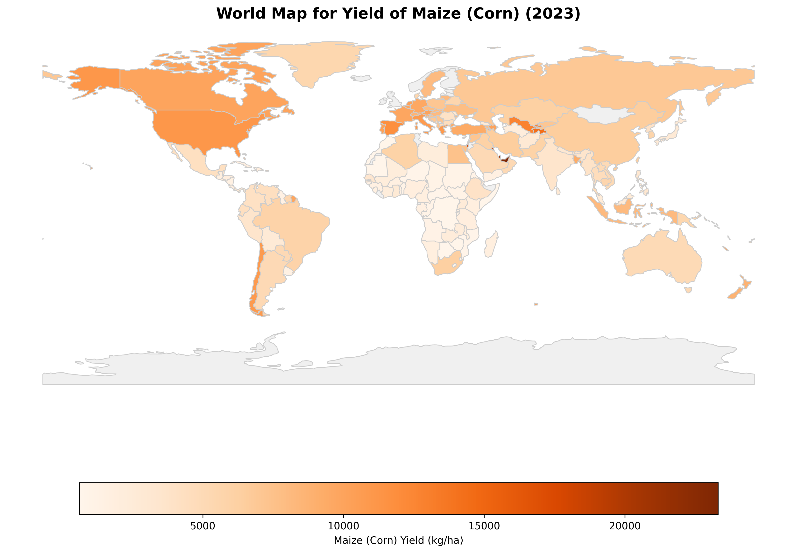
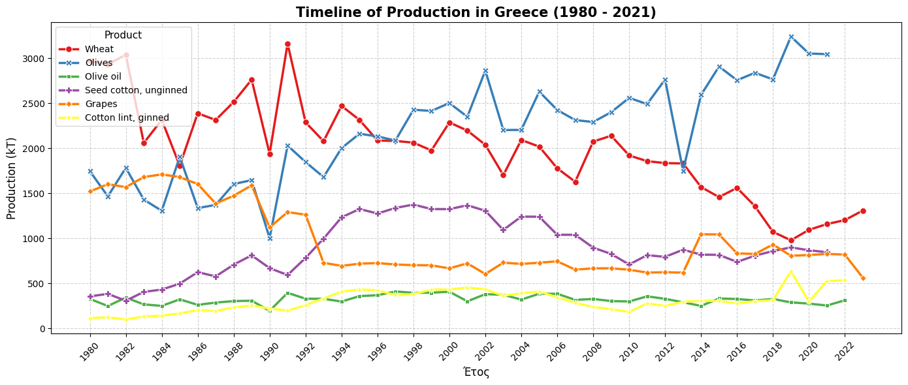

# 🌍 Global & Hellenic Agricultural Analytics (FAOSTAT 1961–2023)

[](https://www.python.org/)
[](https://geopandas.org/)
[](https://scikit-learn.org/)
[](https://opensource.org/licenses/MIT)

## 📌 Project Overview
This repository contains a comprehensive Data Engineering, Geospatial Analysis, and Unsupervised Machine Learning pipeline applied to the **UN Food and Agriculture Organization (FAOSTAT)** database spanning six decades (**1961–2023**).

The study executes an end-to-end analytical workflow: starting with complex data wrangling and unit standardization, advancing through 40-year historical policy timeline evaluations, spatial commodity mapping, and concluding with multidimensional country clustering (**K-Means & PCA**) optimized via **Logarithmic Feature Scaling (`np.log1p`)**.

---

## 🛠️ Complete Analytical Pipeline

### 1. Data Engineering & Integrity Assurance
* **Multi-Environment Ingestion:** Built dynamic data loading pipelines supporting Kagglehub, Google Colab, and local environments.
* **Long-Format Transformation:** Unpivoted 60+ year columns across 79,000+ raw records into a clean long-format dataset exceeding **1.73 million records**.
* **Unit Standardization:** Resolved measurement unit duplicates in livestock data (e.g., egg production metrics in `1000 No` vs `tonnes`), reducing redundant rows by 613 entries.
* **Entity Disambiguation:** Leveraged FAOSTAT M49 coding rules ($Area Code \ge 5000$) and handled special cases (China Code 351) to strictly isolate **210 standalone country entities** from **35 regional aggregates**, eliminating double-counting risks.

### 2. Exploratory Commodity & Yield Diagnostics

* **Global Output Leaders:** Evaluated mass vs. nutrient production, identifying **Sugar cane** (>2.02B tonnes) and **Maize** (1.24B tonnes) as global drivers.

<table>
  <tr>
    <td></td>
    <td></td>
  </tr>
</table>
  
* **Domestic Baseline (Greece):** Mapped Greek output dominated by **Olives** (>3.04M tonnes) followed by Maize (1.35M t), Wheat (1.16M t), and specialized **Sheep Milk** (~952K t) for traditional dairy/feta production.
* **Livestock Efficiency Paradox:** Revealed that while cattle lead global milk yield per animal (3,105 kg/An) compared to sheep (77 kg/An), Greece achieves high national sheep milk volumes through elevated livestock population density.

### 3. Spatial GIS & Historical Policy Analysis (1980–2021)
* **Commodity Spatial Hotspots:** Generated choropleth maps highlighting the geographic concentration of **Olives** in the Mediterranean belt vs. widespread global **Maize/Wheat** distribution.

<table>
  <tr>
    <td></td>
    <td></td>
  </tr>
</table>

* **40-Year Greek Temporal Timeline:** Tracked how agricultural output is shaped by policy and economics:
  * *Olives:* Visualized biological **alternate bearing** (biennial yield swings).
  * *Grapes:* Captured the drop during the **1993 EEC Vine Grubbing Scheme (Reg. 1442/88)** and its post-2012 crisis rebound.
  * *Wheat/Cotton:* Tracked post-1981 EEC accession growth and the post-2004 CAP subsidy decoupling shift.

<p align="center">
    <td></td>
</p>

* **Greece vs. EU Benchmark (2021):** Demonstrated Greece's **+41% yield advantage in Maize (11.20 t/ha vs 7.90 t/ha)** due to climate and irrigation, outperforming the EU in Olives, but trailing in rainfed Wheat.

### 4. Unsupervised ML: Resolving Scale Dominance
* **The Raw Scale Paradox:** K-Means clustering on raw harvested area (`Total_Area_ha`) caused Euclidean distance metrics to be dominated by land outliers (**USA, China, India, Brazil**), isolating them into a 4-country group while merging the rest of the world uniformly.
* **Log-Scaling Solution (`np.log1p`):** Applying logarithmic variance compression enabled **crop portfolio diversity** and **yield efficiency** to participate equally in distance metrics ($79.6\%$ variance explained in 2D PCA).
* **Final Cluster Profiles:**
  * **🟢 Cluster 2 (Diversified Core & Superpowers - 123 Countries):** Agrarian giants & diversified mid-scale producers (Greece, France, USA) averaging ~67 unique crops.
  * **🔴 Cluster 0 (Intensive High-Yield Outliers - 15 Countries):** Specialized land-constrained economies (UAE, Norway) achieving ~42,357 kg/ha via agritech.
  * **🔵 Cluster 1 (Small-Scale / Vulnerable Economies - 61 Countries):** Land-constrained or developing nations (Afghanistan) with low crop diversity (~29 crops).

---

## 🛠️ Tech Stack & Libraries
* **Data Engineering:** `pandas`, `numpy`, `kagglehub`
* **Machine Learning:** `scikit-learn` (`StandardScaler`, `KMeans`, `PCA`)
* **Spatial Analysis & GIS:** `geopandas`, `shapely`, `matplotlib.colors`
* **Visualization:** `matplotlib`, `seaborn`

---

## 📦 How to Run the Notebook

### Option 1: Run Online (Recommended)
You can open and execute the interactive notebook directly on Kaggle with all pre-configured execution environments:
👉 [Open on Kaggle](https://www.kaggle.com/code/andreaskalog/global-agricultural-production-analytical-mappin)

---

### Option 2: Run Locally

1. **Clone the repository:**
   ```bash
   git clone [https://github.com/andrkalogeropoulos-kaixis/Crop-Yield-Prediction-Pipeline.git](https://github.com/andrkalogeropoulos-kaixis/Crop-Yield-Prediction-Pipeline.git)
   cd Crop-Yield-Prediction-Pipeline
